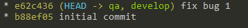

## Fix a bug

At first create a new bugfix branch named after the bug identifier if available

`git checkout -b bug/bug-1 qa`

We need to push the new branch to remote if other developers want to work on fixing the same issue

`git push -u origin bug/bug-1`

After we commit the fix we either merge to develop (if we have scheduled releases in qa instead of directly fixing bugs there)

`git checkout develop`

`git pull origin develop`

`git checkout bug/bug-1`

`git rebase -i develop`

`git checkout develop`

`git merge bug/bug-1`

`git push origin develop`

And the qa branch will be updated in next release

Or we merge to qa and push changes

`git checkout qa`

`git pull origin qa`

Here there is no need to rebase since qa branch should have not be updated with a new release, so we simply merge the bugfix branch

`git merge bug/bug-1`

`git push origin qa`

If the first attempt did not fix the bug and additional work is needed

`git checkout bug/bug-1`

Then we continue work and when ready we merge again following the same procedure as above

When the fix is confirmed and the issue is closed and we have also merged back to the develop branch it is safe to delete the bugfix branch

`git branch -d bug/bug-1`

`git push origin :bug/bug-1`

