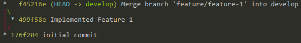

## Work in a feature

At first we create a new feature branch named after the user story identifier if available

`git checkout -b feature/feature-1 develop`

We need to push the new branch to remote if other developers want to work in the same feature.

`(git push -u origin feature/feature-1)`

After all work is done and changes are commited we need to merge the feature branch back to develop

`git checkout develop`

`git pull origin develop`

`git checkout feature/feature-1`

`git rebase -i develop`

Here you can use ‘s’ to squash all commits of your feature branch into a single one, thus allowing for easier code review

`git checkout develop`

`git merge --no-ff feature/feature-1`

`git push origin develop`

If the work in the feature is complete you may now delete it

`git branch -d feature/feature-1`

`git push origin :feature/feature-1`

